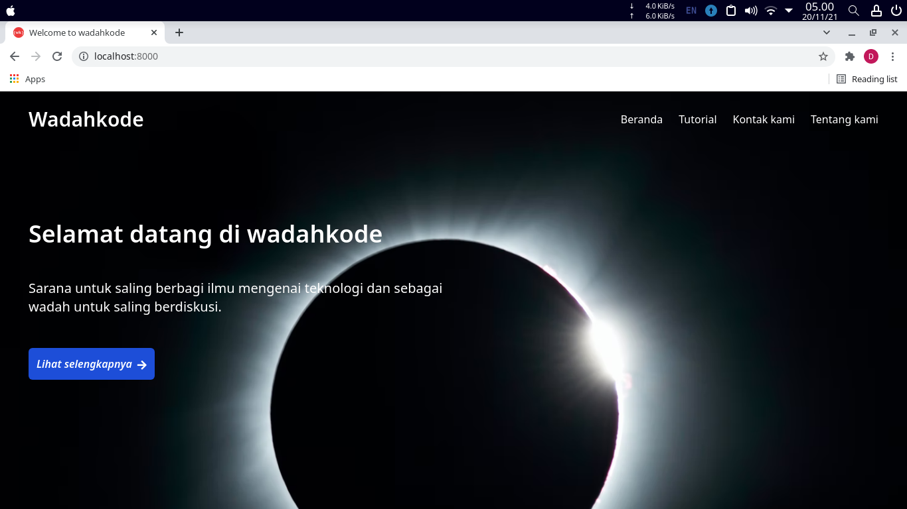

# Framework Indonesia (fwid)



Fwid adalah sebuah kerangka kerja yang dibuat menggunakan bahasa PHP versi 7.x.x, terinspirasi dari framework Laravel dan CodeIgniter.

# Syarat

- PHP 7.x.x
- Basic PHP
- Postgresql, mysql, mariadb
- nodejs

# Untuk mencoba

    $ git clone https://github.com/wadahkode/fwid.git framework-id
    $ cd framework-id
    $ php wadahkode serve

buka browser lalu ketikkan: http://localhost:8000

# Pengembangan

Silahkan lanjutkan untuk pengembangan fitur yang lebih banyak.

# Procfile for heroku

Buka file <code>Procfile</code> dan salin kode berikut untuk menjalankan dengan php:

```shell
web: vendor/bin/heroku-php-apache2 public/
```

# Demo app

Untuk demo lihat di <code>http://wadahkode.herokuapp.com/</code>

# Halaman admin

Mau akses halaman admin, silahkan kunjungi <code>http://wadahkode.herokuapp.com/admin</code>, untuk email dan kata sandi :

   email    : mvp.dedefilaras@gmail.com
   password : admin

Ini gratis, yang dijual adalah jasa layanan jika mau pakai dan engga mau ribet.
